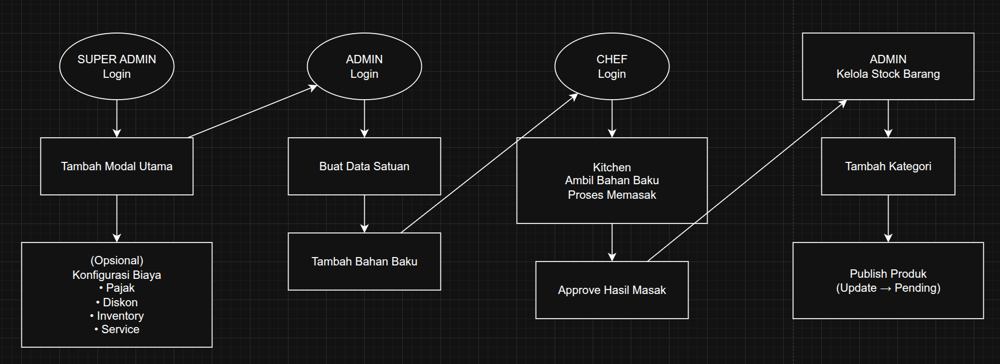

# Kasir Plus

[](LICENSE)

Kasir Plus adalah aplikasi Point of Sale (POS) full-stack untuk operasional toko/resto dengan frontend `React + TypeScript + Vite` dan backend `Express + MongoDB`. Repo ini sudah mencakup alur transaksi kasir, dashboard admin dan manajer, proses dapur/chef, keamanan server, dashboard publik untuk pelanggan, pembayaran online via `Midtrans`, upload gambar via `Cloudinary`, sinkronisasi stok via `Firebase RTDB`, update real-time via `Socket.IO`, serta pondasi laporan keuangan seperti HPP/laba, modal, aset tetap, liabilitas, dan neraca.

## Ringkasan Fitur

- Multi-role login: `super admin`, `admin`, `manajer`, `kasir`, `chef`, `user`, `security`
- Login manual berbasis JWT dan login dengan Google OAuth
- Dashboard publik / pelanggan untuk lihat produk, checkout, dan riwayat pesanan
- Keranjang belanja, checkout, dan proses transaksi dengan status pesanan
- Pembayaran `Tunai`, `Virtual Account`, `QRIS`, dan `E-Wallet` dengan channel yang bisa diatur dari settings
- Integrasi Midtrans untuk pembuatan pembayaran dan callback update status transaksi
- Sinkronisasi stok real-time memakai `Socket.IO` dan transaksi atomik di `Firebase RTDB`
- Manajemen produk, kategori, stok barang, bahan baku, produksi, data satuan, modal utama
- Pengelolaan modal utama, saldo kas, tambah modal, prive, aset tetap, dan riwayat kas
- Pengelolaan kategori biaya operasional dan pencatatan pengeluaran biaya yang memotong saldo kas
- Pengelolaan data kewajiban/liabilitas, termasuk utang supplier yang bisa terhubung ke pembelian bahan baku
- Dashboard admin untuk omzet, top barang, transaksi, breakdown pembayaran, laporan penjualan, dan input penjualan
- Dashboard manajer untuk monitoring stok, riwayat, laporan HPP/laba, dan settings terbatas
- Panel chef untuk bahan baku tersedia, pengambilan bahan baku, dan update status produksi
- Laporan HPP, laba kotor, laba bersih, rekap metode pembayaran, cash flow kasir, dan neraca
- Pengaturan toko: informasi toko, logo, struk, metode pembayaran, channel pembayaran, pajak, diskon global, service charge, low stock alert, bahasa, format tanggal
- Upload gambar produk, logo toko, logo channel pembayaran, dan foto profil
- Export laporan ke `PDF`, `Excel`, dan sebagian area ke `CSV`
- Block IP address otomatis ketika terkena trap routes
- Dashboard security untuk log server, suspicious activities, statistik IP, block/unblock IP, real-time alerts, dan system health
- Smart Notifikasi pada role super-admin yang meliputi Uang Kas, Liabilitas, Stok Barang/Produk
- Business Intelligence dengan mengimplementasikan model AI `Gemini, GPT` kedalam analis data 

## Fitur Per Area

### Super Admin 

- Kelola Modal Utama
- Kelola tambah modal, prive, saldo kas, riwayat kas, aset tetap, bahan baku modal, dan biaya operasional modal
- Kelola Laporan Penjualan, ringkasan laba, detail laba, rekap metode pembayaran, dan neraca
- Mengatur pengaturan aplikasi 
- Mengatur Biaya Layanan
- Menambah atau menghapus user
- Kelola master biaya operasional dan pengeluaran biaya
- Kelola Data Kewajiban/liabilitas, termasuk pembayaran kewajiban
- Kelola Neraca berbasis aset, liabilitas, dan ekuitas
- Akses dashboard Business Intelligence
### Admin

- Kelola stok barang, status barang, dan publikasi barang
- Kelola bahan baku, data satuan, kategori produk, produksi, dan status produksi
- Lihat dashboard transaksi, status pesanan, top barang, omzet, dan breakdown pembayaran
- Kelola status pesanan: approve, cancel, dan update status manual
- Kelola riwayat transaksi

### Manajer

- Pantau dashboard operasional
- Lihat stok barang, riwayat transaksi, laporan HPP/laba, dan biaya operasional
- Akses sebagian settings yang relevan untuk operasional
- Lihat rekap metode pembayaran, tanggal laporan harian, dan total penjualan

### Kasir

- Membuat transaksi dan memantau status pembayaran
- Mengelola pesanan aktif
- Mendapat assignment kasir otomatis jika transaksi dibuat tanpa memilih kasir
- Melihat laporan cash flow harian/rentang, rekap metode pembayaran, dan item terlaris

### Chef

- Melihat daftar produksi
- Melihat bahan baku tersedia
- Mengambil bahan baku dan mengubah status produksi

### Security

- Memantau Log Server
- Melakukan Block IP Address
- Memantau kesehatan server 
- Melihat suspicious activities, statistik IP, detail blocked IP, dan real-time alerts

### Users

- Register dan login
- Login via Google
- Lihat katalog produk
- Checkout dan bayar secara online
- Cek status transaksi publik dan riwayat pesanan pribadi


## Algoritma Dan Logika Bisnis

Repo ini tidak memakai algoritma kompleks seperti machine learning, tetapi ada beberapa logika bisnis inti yang penting:

- Perhitungan harga final barang:
  harga jual dihitung ulang dari kombinasi `global discount`, `tax`, dan `service charge`, lalu dibulatkan ke bilangan bulat.
- Round-robin assignment kasir:
  jika transaksi dibuat tanpa `kasir_username`, backend memilih kasir aktif berikutnya secara bergiliran memakai counter di database.
- Sinkronisasi stok atomik:
  saat transaksi dibuat, stok dikurangi melalui `Firebase RTDB transaction` agar bentrok update stok lebih aman ketika ada beberapa client aktif sekaligus.
- Perhitungan HPP dan laba harian:
  backend mengakumulasi HPP per item, pendapatan, laba kotor, total beban, dan laba bersih per tanggal.
- Perhitungan neraca:
  backend menghitung aset dari kas, persediaan barang, persediaan bahan baku, dan aset tetap; liabilitas dari kewajiban aktif; ekuitas sebagai penyeimbang `aset - liabilitas`.
- Pencatatan kewajiban:
  kewajiban menyimpan `jumlah_awal`, `sisa_jumlah`, status pelunasan, jatuh tempo, riwayat pembayaran, dan bisa terhubung ke `BahanBaku` untuk skenario utang supplier.
- Pembayaran kewajiban:
  pembayaran liabilitas mengurangi `saldo_kas` di Modal Utama dan menambahkan riwayat pengeluaran kas.
- Pengeluaran biaya:
  pencatatan pengeluaran operasional mengurangi `saldo_kas`, masuk ke riwayat kas, dan ikut memengaruhi perhitungan laba bersih/HPP harian.
- Modal dan aset tetap:
  tambah modal menambah kas, prive mengurangi kas dan sisa modal, pembelian aset tetap mengurangi kas dan menambah daftar aset tetap.
- Validasi metode pembayaran:
  metode dan channel pembayaran divalidasi terhadap data settings, sehingga hanya metode/channel aktif yang terdaftar yang bisa dipakai.
- Mapping callback pembayaran:
  notifikasi Midtrans dipetakan kembali ke metode seperti `Virtual Account`, `QRIS`, atau `E-Wallet` agar status transaksi konsisten di aplikasi.

## Modul Backend Utama

- Auth: register, login manual, Google OAuth, token/session bridge
- Transaksi: create, cancel, delete, update status, cek status publik, Midtrans callback
- Barang dan stok: CRUD barang, publish barang, decrement stok, kategori, data satuan
- Bahan baku dan produksi: CRUD bahan baku, sinkron ke modal utama, produksi, approval/publish, pengambilan bahan oleh chef
- Modal utama: saldo kas, tambah modal, prive, bahan baku modal, biaya operasional modal, aset tetap
- Biaya dan pengeluaran: master kategori biaya operasional, pengeluaran biaya, biaya layanan
- Kewajiban/liabilitas: CRUD kewajiban, ringkasan, pembayaran, relasi opsional ke bahan baku
- Laporan: penjualan, laba, detail laba, HPP harian/summary, rekap metode pembayaran, neraca
- Kasir analytics: daily cash flow, cash flow range, payment methods summary, best selling items
- Security: logs, suspicious activities, IP statistics, blocked IP management, alerts, system health
- Settings: toko, logo, struk, metode pembayaran, channel pembayaran, pajak, diskon, service charge, default profile picture
- Profile dan cart: profil user, foto profil, keranjang belanja

## Struktur Project

```text
Aplikasi-Kasir/
├─ backend/    # API Express, MongoDB, Midtrans, Firebase, Cloudinary
├─ frontend/   # React, TypeScript, Vite, Tailwind, Ant Design
├─ README.md
└─ package.json
```

## Tech Stack

- Frontend: `React 19`, `TypeScript`, `Vite`, `TailwindCSS`, `Ant Design`, `Axios`, `Socket.IO Client`, `Recharts`, `Framer Motion`, `Chart.js`
- Backend: `Node.js`, `Express 5`, `Mongoose`, `Socket.IO`, `Helmet`, `express-rate-limit`, `express-session`, `passport-google-oauth20`, `multer`
- Database dan sinkronisasi: `MongoDB`, `Firebase RTDB`
- Integrasi pihak ketiga: `Midtrans`, `Cloudinary`, `Firebase Admin`, `Google OAuth`
- Export laporan: `jsPDF`, `jspdf-autotable`, `xlsx`

## Cara Menjalankan

### 1. Backend

```bash
cd backend
npm install
cp .env.example .env
npm start
```

Backend berjalan di `http://localhost:5000` secara default.

### 2. Frontend

```bash
cd frontend
npm install
npm run lint
npm run dev
```

Frontend berjalan di `http://localhost:5173` secara default.

## Environment Backend

Isi file `backend/.env` berdasarkan `backend/.env.example`.

```env
# Database
MONGO_URI=
FIREBASE_DATABASE_URL=

# Authentication
JWT_SECRET=
SESSION_SECRET=

# Midtrans
MIDTRANS_SERVER_KEY=
MIDTRANS_CLIENT_KEY=

# Cloudinary
CLOUDINARY_CLOUD_NAME=
CLOUDINARY_API_KEY=
CLOUDINARY_API_SECRET=

# Google
GOOGLE_CLIENT_ID=
GOOGLE_CLIENT_SECRET=

# App
FRONTEND_URL=http://localhost:5173
CORS_ORIGIN=http://localhost:5173,http://127.0.0.1:5173
ENABLE_DEBUG_TOKEN_LOGGER=false
BACKEND_URL=https://xxx.ngrok-free.app 
MODE=ON/OFF # Pilih satu
RATE_LIMIT_WINDOW_MS=900000 # Lama Waktu dalam (ms)
RATE_LIMIT_MAX=600 # Max request dalam waktu RATE_LIMIT_WINDOW_MS

```

Catatan:

- `SESSION_SECRET` wajib, backend akan gagal start jika kosong.
- `JWT_SECRET` wajib untuk login, route protected, dan Google callback token.
- File service account Firebase yang nyata tidak boleh di-commit.
- `CORS_ORIGIN` mendukung beberapa origin dipisah koma.

## Environment Frontend

- `Otomatis mendeteksi ip laptop yang langsung terhubung dengan backend(5000) sehingga saat ip frontend terganti tidak menjadi masalah`

## Script Penting

### Backend

```bash
npm run check
npm start
```

Script utilitas yang tersedia di `backend/scripts/`:

- `create-test-chef.js`
- `create-test-bahanbaku.js`
- `recalc-prices.js`
- `recalc-total-harga-bahan.js`
- `migrate-to-firebase.js`
- `check-syntax.js`

Contoh:

```bash
node scripts/migrate-to-firebase.js
```

### Frontend

```bash
npm run dev
npm run build
npm run lint
npm run preview
```

## Cara Bikin Produk



## API Penting

Prefix role dilindungi oleh kombinasi token dan `authorize()` sesuai area masing-masing.

### Public / User

- `POST /auth/register` dan `POST /auth/login`
- `GET /api/barang`
- `POST /api/transaksi`
- `GET /api/transaksi/public/status/:order_id`
- `GET /api/cart`, `POST /api/cart`, `DELETE /api/cart/:barangId`, `DELETE /api/cart`
- `PUT /api/update-profile/user/:id`

### Admin

- `GET /api/admin/dashboard/omzet`
- `GET /api/admin/dashboard/top-barang`
- `GET /api/admin/dashboard/breakdown-pembayaran`
- `GET /api/admin/stok-barang`, `POST /api/admin/stok-barang`
- `POST /api/admin/stok-barang/production`
- `GET /api/admin/bahan-baku`, `POST /api/admin/bahan-baku`
- `GET /api/admin/laporan/ringkasan`
- `GET /api/admin/laporan/laba`
- `GET /api/admin/laporan/detail-laba`
- `GET /api/admin/laporan/neraca`
- `GET /api/admin/hpp-total` dan `GET /api/admin/hpp-total/summary`
- `GET /api/admin/kewajiban`, `POST /api/admin/kewajiban`, `POST /api/admin/kewajiban/:id/bayar`
- `GET /api/admin/pengeluaran-biaya`, `POST /api/admin/pengeluaran-biaya`

### Super Admin

- `GET /api/super-admin/dashboard/omzet`
- `GET /api/super-admin/laporan/neraca`
- `GET /api/super-admin/modal-utama`
- `POST /api/super-admin/modal-utama/tambah-modal`
- `POST /api/super-admin/modal-utama/prive`
- `POST /api/super-admin/modal-utama/aset-tetap`
- `GET /api/super-admin/kewajiban`
- `GET /api/super-admin/kewajiban/ringkasan`
- `POST /api/super-admin/kewajiban/:id/bayar`
- `GET /api/super-admin/settings`
- `GET /api/super-admin/users`

### Manajer, Kasir, Chef, Security

- `GET /api/manager/dashboard`
- `GET /api/manager/laporan/laba`
- `GET /api/manager/stok-barang`
- `GET /api/kasir/analytics/daily-cash-flow`
- `GET /api/kasir/analytics/cash-flow-range`
- `GET /api/chef/productions`
- `POST /api/chef/bahan-baku/ambil`
- `PUT /api/chef/productions/:id/status`
- `GET /api/security/logs`
- `GET /api/security/blocked-ips`
- `POST /api/security/blocked-ips`

## Keamanan Server

Beberapa lapisan keamanan yang sudah ada di repo:

- `Helmet` untuk menambah HTTP security headers dasar
- `CORS` whitelist berbasis `CORS_ORIGIN` / `FRONTEND_URL`
- `express-rate-limit` untuk semua route `/api/`
- `JWT` untuk autentikasi route protected
- `authorize()` untuk pembatasan role per area
- `express-session` dengan cookie `httpOnly` dan `sameSite=lax`
- Password user di-hash dengan `bcrypt`
- `x-powered-by` dimatikan
- Ada trap route sederhana untuk mendeteksi probing ke path umum seperti `/.env`, `/.git`, dan `/wp-admin`

Catatan kondisi keamanan saat ini:

- Secara umum fondasi keamanan backend sudah ada, tetapi belum sepenuhnya hardened untuk production.
- Beberapa endpoint masih mengandalkan proteksi di level router internal, jadi review akses per route tetap penting setiap kali menambah endpoint baru.
- Middleware API key sudah ada file-nya, tetapi saat ini belum aktif sebagai lapisan proteksi utama.
- Session cookie hanya `secure` ketika `NODE_ENV=production`, jadi deployment production perlu memastikan reverse proxy dan HTTPS sudah benar.
- Callback Google sekarang tidak perlu lagi mengirim JWT lewat URL; frontend menukar session login menjadi token setelah redirect.
- Midtrans client di konfigurasi saat ini masih `isProduction: false`, jadi perlu disesuaikan saat go-live.
- README ini mendeskripsikan keamanan berdasarkan implementasi repo per 28 Maret 2026, bukan hasil audit penetration test formal.

## Arsitektur Singkat

- Frontend memakai route protection berdasarkan role dan token login.
- Backend memisahkan area `admin`, `manager/manajer`, `chef`, `kasir`, `user`, dan endpoint publik.
- Transaksi dibuat di backend, lalu stok disinkronkan ke MongoDB dan Firebase.
- Perubahan stok disiarkan ke client terkait memakai `Socket.IO`.
- Status pembayaran online diperbarui dari callback Midtrans.
- Settings aplikasi menjadi sumber konfigurasi untuk pajak, diskon, service charge, receipt, payment methods, dan channel pembayaran.
- Modal utama menjadi sumber saldo kas, sisa modal, aset tetap, dan riwayat arus kas internal.
- Kewajiban aktif menjadi sumber liabilitas untuk neraca.
- Neraca saat ini memakai snapshot data berjalan, bukan sistem jurnal akuntansi double-entry penuh.

## Role Akses

- `super-admin`: akses dashboard meliputi (omzet, modal utama, ringkasan pendapatan, status user per role), laporan penjualan, neraca, modal utama, aset tetap, liabilitas, biaya, konfigurasi aplikasi, CRUD management user
- `admin`: akses omzet, top barang, breakdown pembayaran, stok, bahan baku, kategori, data satuan, HPP, status pesanan, dan monitoring proses masak
- `manajer`: akses monitoring operasional, stok, riwayat, laporan, dan sebagian settings
- `kasir`: akses transaksi, pesanan, dan analytics cash flow
- `chef`: akses produksi dan bahan baku
- `security` : akses log server, suspicious activity, statistik IP, block/unblock IP, alerts, dan system health
- `user`: akses halaman publik, checkout, riwayat pribadi, dan profil

## Catatan Pengembangan

- Struktur repo masih memiliki beberapa file lama / duplikat, terutama di area auth dan transaksi frontend.
- Penamaan `manajer` dan `manager` dipakai bersamaan di beberapa bagian untuk kompatibilitas role.
- Dokumentasi backend tambahan juga ada di `backend/readme.md`, tetapi README utama ini sekarang menjadi ringkasan repo yang lebih lengkap.
- Laporan neraca sudah tersedia sebagai snapshot posisi keuangan, tetapi belum memakai jurnal double-entry penuh.
- Beberapa route kosong/legacy masih ada, seperti `backend/routes/chef/dashboard.js`, `backend/routes/security/dashboard.js`, dan `backend/routes/LaporanRoutes.js`.

## Checklist Setup Cepat

1. Isi `backend/.env`
2. Jalankan backend
3. Pastikan MongoDB, Firebase, Midtrans, dan Cloudinary sudah terkonfigurasi
4. Isi env frontend bila diperlukan
5. Jalankan frontend
6. Pastikan `VITE_API_URL` cocok dengan URL backend
7. Pastikan `CORS_ORIGIN` backend mengizinkan origin frontend

## License

Lihat [LICENSE](LICENCE) untuk detail lebih lanjut tentang license.

